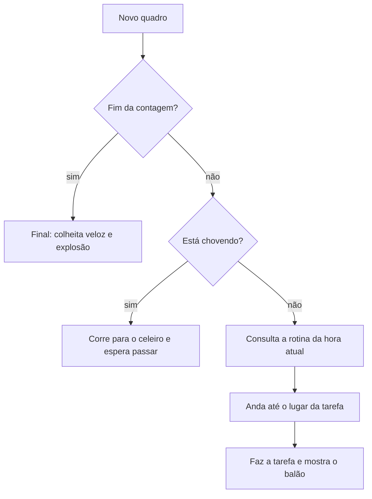

<div align="center">

# 🌻 Fazenda do Tempo 🚜

### Uma contagem regressiva calma, em pixel art, para quem está esperando algo importante.

*Em vez de olhar números caindo, você acompanha um fazendeiro vivendo o dia dele, enquanto a plantação cresce junto com a sua espera. Quando o relógio zera... bom, a fazenda explode. 💥*

<br>


<br>


</div>

---

## 📖 Sobre o projeto

**Fazenda do Tempo** é um temporizador regressivo feito em **um único arquivo HTML**, sem instalar nada, sem build, sem biblioteca. Ele foi pensado para ajudar a **controlar a ansiedade** durante a espera por um evento importante.

A tela inteira é uma fazenda em pixel art, inspirada no clima aconchegante de *Stardew Valley*. O relógio e a contagem flutuam sobre o cenário, e tudo ali dentro tem vida própria: o céu muda com a hora real, a plantação cresce conforme o tempo passa e o fazendeiro decide sozinho o que fazer.

> 💡 **A ideia:** o tempo passa de qualquer jeito. Então que ele passe numa fazenda bonita, devagar, com alguém cuidando de você.

---

## ✨ Funcionalidades

### ⏰ Relógio e contagem

- **Relógio ao vivo** com dia da semana, data, hora, minuto e segundo, lido do relógio do seu aparelho.
- **Contagem regressiva** em dias, horas, minutos e segundos, recalculada a cada segundo (fechar e abrir a página nunca atrasa nada).
- **Barra de progresso** com uma plantinha que cresce: 🌱 → 🌿 → 🌷 → 🌻.
- **Cores que respiram:** o tom da interface muda devagar do azul ao lilás conforme a data se aproxima.
- O texto *"Faltam para terça-feira, 13/10 às 13:00"* é gerado automaticamente a partir da data configurada.

### 🧑‍🌾 Um fazendeiro que parece ter vontade própria

O fazendeiro não fica parado nem teletransporta. Ele **anda até cada lugar**, faz a tarefa e mostra um **balão de pensamento** com o emoji do que vai fazer.



- ☔ **Foge da chuva:** quando chove, ele corre para o celeiro, entra, e as janelas acendem. Quando para de chover, ele sai e volta ao trabalho. O gatinho também se esconde.
- 💤 **Dorme de verdade:** de madrugada ele vai até o celeiro, entra, e os "z" saem pela janela.
- 🐔 **Segue as galinhas** na hora de alimentar os bichos.
- 🔥 **Acende a fogueira** e senta ao lado dela à noite; depois vai olhar as estrelas na beira da lagoa.
- 🎆 **À meia-noite** faz uma festa com pulos e fogos de artifício.

### 🌱 Plantação que cresce com a espera

As plantas evoluem em 4 estágios (broto, folhas, fruto) conforme a barra de progresso avança. São três fileiras: **abóboras**, **tomates** e **milho**. Quando o tempo acaba, tudo é colhido.

### 🌤️ Mundo vivo

- **Ciclo real de dia e noite:** as cores do céu mudam hora a hora, com sol, lua, estrelas piscando e janelas acesas.
- **Nuvens** passeando, **pássaros** de dia, **vagalumes** à noite, **lagoa** com brilho na água.
- **Chuva** que você liga e desliga, de dia ou de noite.

### 🧘 Foco na saúde mental

- **Conselho do Sábio Espantalho:** a cada virada de hora, uma mensagem de acolhimento aparece embaixo, digitada letra por letra, e some sozinha depois de 15 segundos.
- **Respiração guiada:** um círculo que cresce e encolhe no ritmo *inspire 4s → segure 2s → solte 6s*.
- **Sininho suave** a cada hora (opcional).

### 💥 Final épico

Quando o cronômetro chega a zero **com a página aberta**:

| Tempo | O que acontece |
|:--|:--|
| 0 – 6 s | 🌽 **Colheita veloz:** o fazendeiro corre colhendo tudo |
| ~9 s | 🧨 "OPS..." e a tela começa a tremer de leve |
| 10 – 12 s | Contagem **3... 2... 1...** |
| 12 s | 💥 **BOOM:** flash branco, tela sacudindo, cratera e fumaça |
| 12 – 30 s | 🎆 Fogos de artifício sobre a fazenda destruída |
| depois | O fazendeiro fica chamuscado, e a fazenda segue explodida |

> Se você abrir a página **depois** do horário final, a fazenda já aparece explodida.

---

## 🚀 Como usar

Não precisa instalar nada.

1. Baixe o arquivo `index.html` (ou `Fazenda do Tempo.html`).
2. Dê um **duplo clique** para abrir no navegador (Chrome, Edge, Firefox ou Safari).
3. Pronto. A fazenda aparece em tela cheia.

> 🌐 A fonte *Press Start 2P* e a *Nunito* vêm do Google Fonts. Sem internet tudo funciona do mesmo jeito, só com fontes de reserva.

### Publicar no GitHub Pages (para abrir no celular)

1. Renomeie o arquivo para `index.html` e suba para o repositório.
2. Vá em **Settings → Pages**.
3. Em *Source*, escolha a branch `main` e a pasta `/ (root)`.
4. Em alguns minutos o site estará em `https://SEU-USUARIO.github.io/NOME-DO-REPOSITORIO/`.

---

## 🛠️ Como personalizar

### 📅 Mudar a data alvo

Procure este trecho no começo do `<script>`:

```js
const TARGET = new Date(2026, 9, 13, 13, 0, 0).getTime(); // data do evento
const START  = new Date(2026, 9, 8, 0, 0, 0).getTime();   // quando a espera começou
```

O formato é `new Date(ano, mês, dia, hora, minuto, segundo)`.

> ⚠️ **Os meses começam em 0:** Janeiro = `0`, Outubro = `9`, Dezembro = `11`.

`START` serve para calcular a barra de progresso, o crescimento da plantação e a cor da interface. O texto "Faltam para..." se ajusta sozinho.

### 💬 Trocar as mensagens do Espantalho

Edite o array `MSGS`. Basta escrever frases novas entre aspas. A mensagem de cada hora é escolhida pelo dia do mês somado à hora, então ela muda ao longo da semana.

### 🕒 Mudar a rotina do fazendeiro

Edite o array `A`. Cada linha segue o formato `['tarefa', 'texto', 'emoji']`, e a posição na lista é a hora (0 a 23):

```js
['regar', 'Regando com paciência', '💧']
```

Tarefas disponíveis: `festa`, `dormir`, `acordar`, `arar`, `plantar`, `regar`, `adubar`, `capinar`, `animais`, `almoco`, `cochilo`, `relaxar`, `fogueira` e `estrelas`.

---

## 🎮 Controles

Toque na bolinha **🌻** no canto inferior direito para abrir o menu. Toque fora dele para fechar.

| Botão | O que faz |
|:--|:--|
| 🫁 **Respirar** | Abre o guia de respiração em tela cheia |
| 🔔 **Mensagem** | Mostra agora um conselho do Espantalho |
| ☁️ **Clima** | Liga e desliga a chuva (e faz o fazendeiro correr para o celeiro) |
| 🔈 **Som** | Liga e desliga o sininho e o som da explosão |
| 🧪 **Testar final** | Roda o final explosivo na hora, sem esperar |
| ↺ **Resetar** | Volta tudo ao tempo real |

---

## 🕰️ Rotina de 24 horas

<details>
<summary><b>Ver o que o fazendeiro faz a cada hora</b></summary>

<br>

| Hora | Atividade | Onde |
|:-:|:--|:--|
| 00h | 🎉 Comemora a virada do dia com fogos | Centro da fazenda |
| 01h – 05h | 💤 Dorme | Dentro do celeiro |
| 06h | 🌅 Acorda e se espreguiça | Porta do celeiro |
| 07h | ⛏️ Ara a terra | Borda de cima da plantação |
| 08h | 🌱 Planta as sementes | Frente da plantação |
| 09h | 💧 Rega | Lado esquerdo |
| 10h | 🐔 Alimenta as galinhas | Segue as galinhas no cercado |
| 11h | 🌻 Aduba a plantação | Frente da plantação |
| 12h | 🥪 Almoça | Sombra da árvore |
| 13h | 🌾 Continua o plantio | Frente da plantação |
| 14h | 🌿 Tira as ervas daninhas | Lado direito |
| 15h | 😴 Cochilo na grama | Sombra da árvore |
| 16h | 🚿 Rega de novo | Lado esquerdo |
| 17h | 🐓 Brinca com as galinhas | Cercado |
| 18h | 🌇 Admira o pôr do sol | Beira da lagoa |
| 19h | 🪴 Última checada nos brotos | Frente da plantação |
| 20h | 🔥 Acende a fogueira | Fogueira |
| 21h | 🏕️ Assa marshmallow | Fogueira |
| 22h | ✨ Conta estrelas | Beira da lagoa |
| 23h | 🥱 Vai deitar | Celeiro |

</details>

---

## 🧩 Como funciona por dentro

- **Tudo em um arquivo:** HTML, CSS e JavaScript juntos, sem nenhuma imagem externa.
- **Pixel art procedural:** o fazendeiro, os bichos, a plantação, o celeiro e as árvores são desenhados por código no `<canvas>`, a partir de pequenas matrizes de caracteres.
- **Tela adaptável:** a cena tem 320×180 pixels lógicos e se estende para os lados (monitor largo) ou para cima e para baixo (celular em pé), sempre ocupando a tela inteira com os pixels nítidos.
- **Relógio confiável:** a contagem usa `Date.now()` a cada segundo, sem acumular atraso.
- **Som sintetizado:** o sininho e a explosão são gerados com a Web Audio API, sem arquivos de áudio.

```
fazenda-do-tempo/
├── index.html      # o projeto inteiro
├── README.md
└── docs/
    └── screenshot.png
```

---

## 🧰 Tecnologias

| | |
|:--|:--|
| **HTML5** | Estrutura da página |
| **CSS3** | Painéis de vidro, animações, interface responsiva e com área segura para celular |
| **JavaScript (vanilla)** | Contagem, rotina do fazendeiro, estados e eventos |
| **Canvas 2D** | Todo o cenário em pixel art |
| **Web Audio API** | Sons opcionais |
| **Google Fonts** | *Press Start 2P* e *Nunito* |

---

## 🗺️ Ideias para o futuro

- [ ] Vaquinha e mais animais na fazenda
- [ ] Estações do ano e neve
- [ ] Trilha sonora ambiente relaxante
- [ ] Campo para escolher a data direto na tela, sem mexer no código
- [ ] Mais mensagens e mensagens por categoria (trabalho, saúde, viagem)

Sugestões e *pull requests* são bem-vindos. 💛

---

## 📄 Licença

Distribuído sob a licença **MIT**. Use, modifique e compartilhe à vontade.

---

<div align="center">

**Respire fundo. Uma hora de cada vez. Você vai chegar lá.** 🌱

</div>
